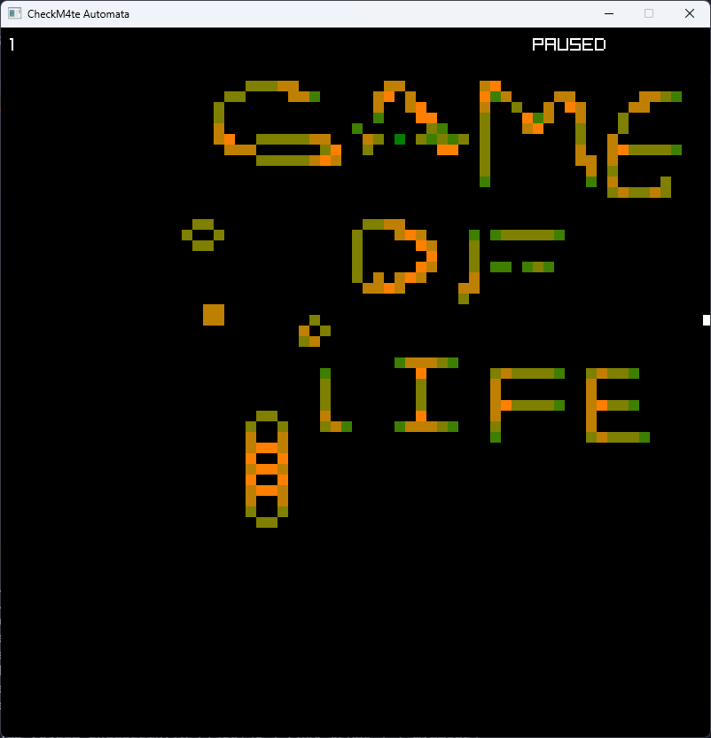

# checkm4te conway's game of life
A game of life implementation written in Go with Raylib. I used my [Automata template](https://github.com/checkm4ted/automata) to make this.
Includes a editor, play pause, simulation speed, and zoom.

RIP John Horton Conway 

## rules
1. Any live cell with fewer than two live neighbours dies, as if by underpopulation.  
2. Any live cell with two or three live neighbours lives on to the next generation.  
3. Any live cell with more than three live neighbours dies, as if by overpopulation.  
4. Any dead cell with exactly three live neighbours becomes a live cell, as if by reproduction.  

## screenshots

